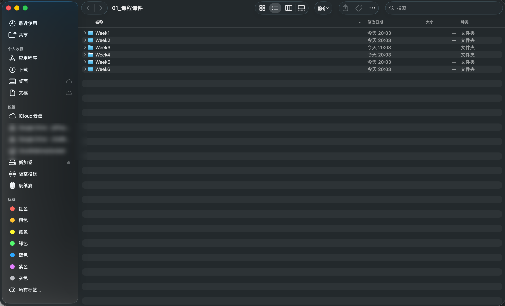
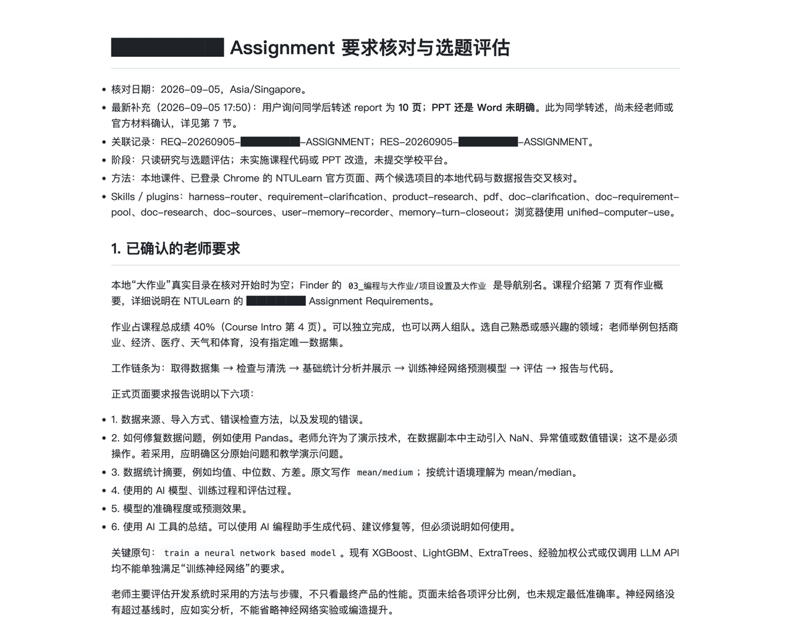
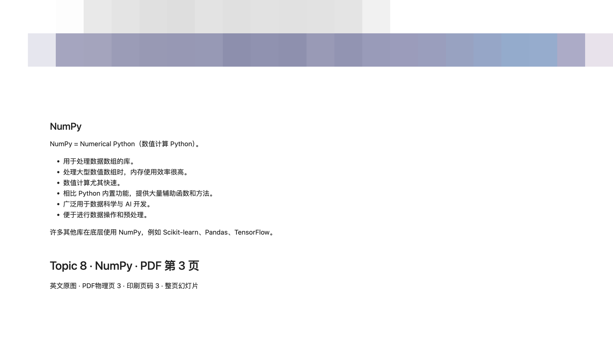
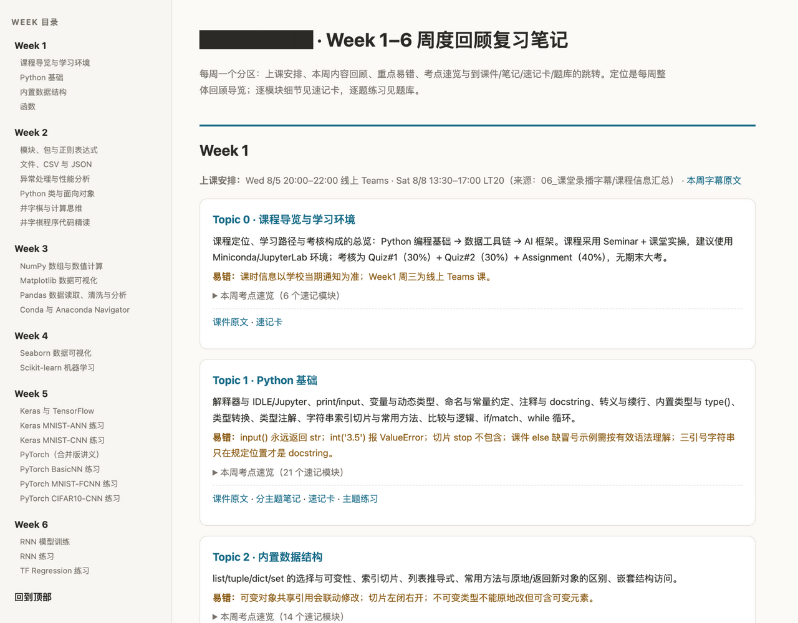
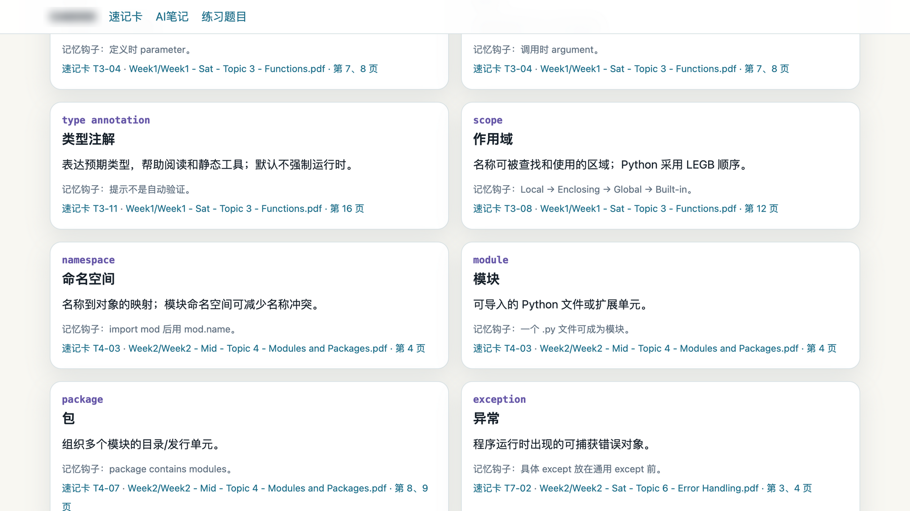
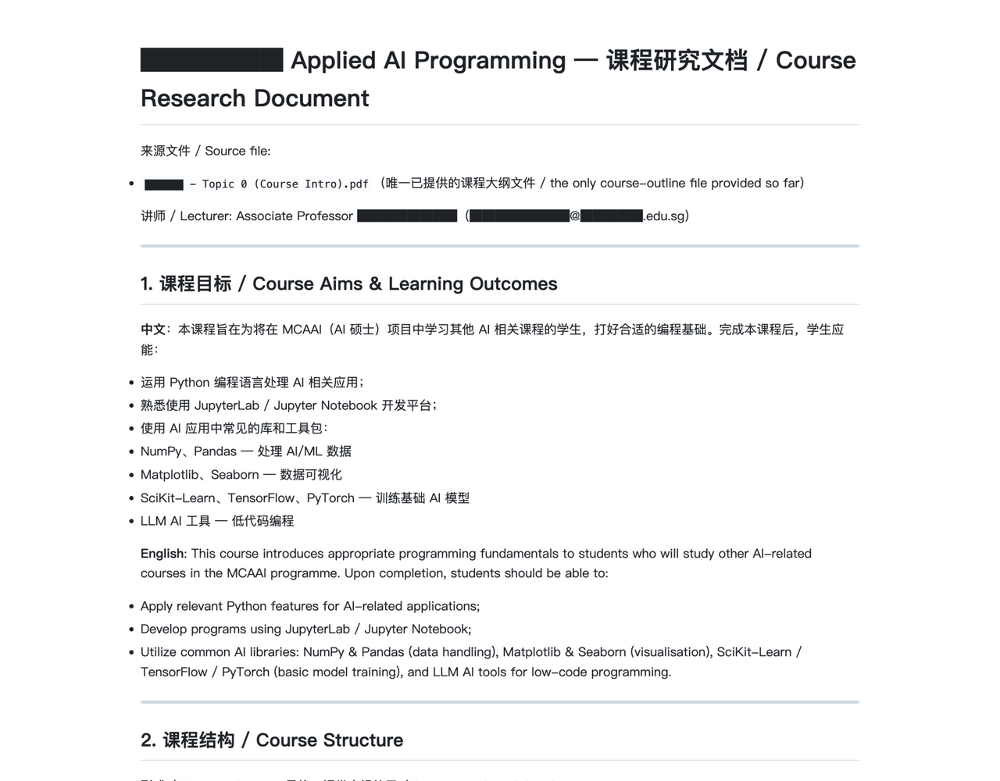
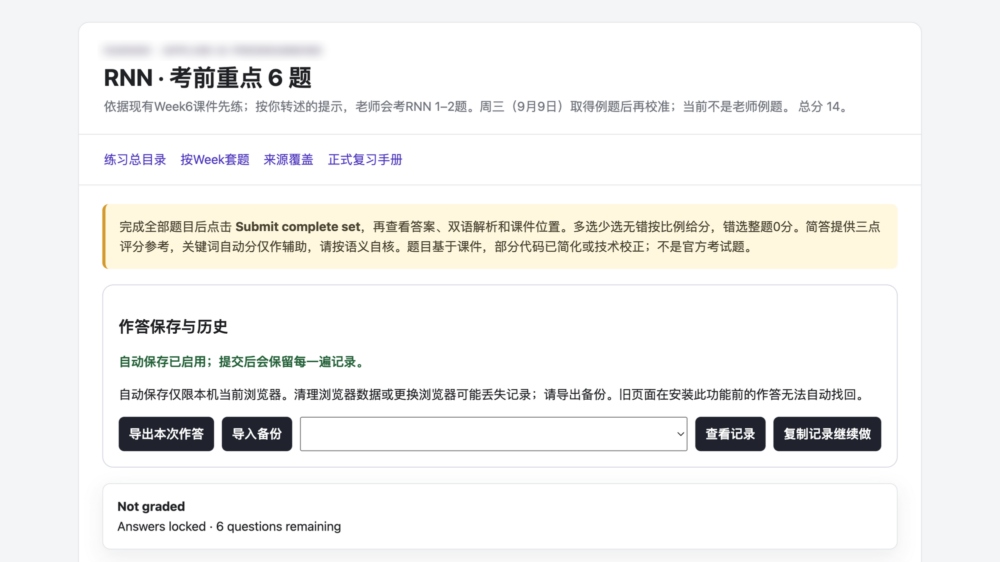
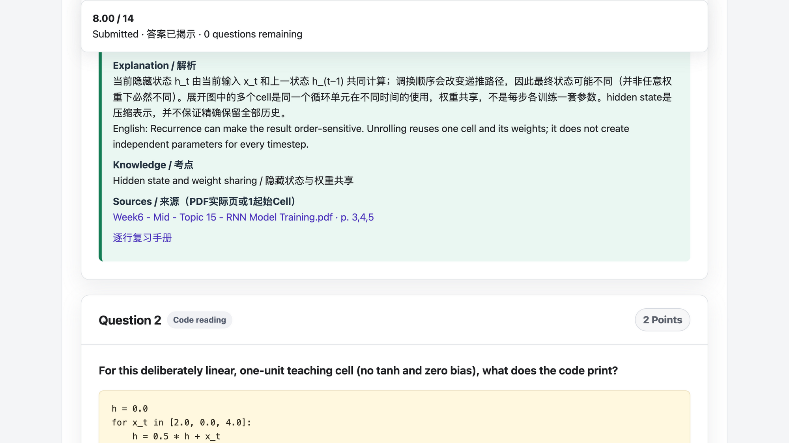

# oh-my-ntu

## 1. 这是什么？

oh-my-ntu 是一个 SKILL 集合，来源于作者在 NTU 读书时期的痛苦经历——作为某计算机专业的第二届学生，面对读不完的 PPT、做不完的 Tutorial、3 周一次的考试，加上毫无历史题目可供参考，作者灵机一动做出了这个 SKILL。它能帮你：

- 把散落在 NTULearn 的课件按周归档、统一命名，不用再一页页翻网站
- 把每页英文课件做成中英对照笔记：上面是课件原图，下面是完整中文翻译，上课对照着边听边看，完美解决听不懂的问题
- 整理每门大作业的要求、截止时间和评分标准，并生成提交模板，防止错过 DDL
- 按周整理复习笔记，按专题整理分析笔记
- 考前自动生成速记卡和中英术语表，几分钟过完一门课的关键概念，救你于水火之中
- 整理课堂录播字幕，提取老师上课的重点，防止错过关键信息
- 出练习题和 Quiz/Final 模拟卷——没有历年题，就让 AI 照着老师的 Sample 题风格出一套

你只需要把它装进电脑上的 AI 助手，AI 就学会了这一整套做法，把一门课从头整理到尾。

## 2. 最终成品是什么？

装好之后，AI 会在你的课程文件夹里产出固定的七个文件夹：

| 文件夹 | 里面放什么 | 你什么时候用它 |
|---|---|---|
| `01_课程课件` | 老师的 PDF、PPT、Tutorial，按周分好，命名统一 | 想找某一周的原始课件时 |
| `02_大作业` | 作业要求、截止时间、评分标准，以及照着要求做的提交模板 | 写作业前核对要求、怕错过 DDL 时 |
| `03_Notebook课件中英文对照解析` | 每周一本中英对照笔记：上面是课件英文原图，下面是完整中文翻译 | 课前预习、上课跟不上时 |
| `04_复习笔记` | 按周整理的回顾笔记、按专题整理的分析笔记 | 平时复习、期中期末前 |
| `05_考前速记与关键术语宝典` | 能搜索、能按周筛选的速记卡网页，外加中英术语表和五分钟速览 | 考前一两天快速过知识点 |
| `06_课堂录播字幕` | 每节课的字幕原文，提取老师上课的重点，防止错过关键信息 | 忘了哪节课讲了什么时 |
| `07_题库与模拟考试` | 周练习、主题练习、Quiz/Final 模拟卷，还有老师发的 Sample 题 | 平时自测、考前刷题 |

实际做出来的东西长这样：

**01_课程课件——按周归档。** 老师的原件全部归入对应周的文件夹：讲义、Tutorial、配套代码和数据各归其位，文件名统一成"WeekN_星期_主题"格式，找哪周的材料一眼定位。



**02_大作业——要求核对与选题评估。** 作业发布后，AI 先把官方要求逐条核对成分析笔记：占多少分、可否组队、报告要覆盖哪六项、工作链条是什么——先把规矩吃透，再动工。



**03_Notebook课件中英文对照解析。** 每一页分成上下两部分：上面是老师课件的原图，下面是 AI 写的完整中文翻译。笔记在 VS Code 或 Cursor 里打开，旁边挂着 AI 边栏，可以一边看原图、一边看翻译、一边让 AI 讲这一页。



**04_复习笔记——周度回顾。** 每周一份回顾页：本周每个 Topic 的要点和易错点，左侧按周导航，每个考点都能一键跳去速记卡和对应练习。



**05_考前速记与关键术语宝典。** 每个术语一张卡：英文、中文、解释、记忆方法，底下标着来自哪份文件第几页。支持搜索和按周筛选。



**06_课堂录播字幕——课程信息汇总。** 每节课的字幕原文存档之外，AI 还从课程大纲里提炼出中英对照的课程研究文档：课程目标、考核构成、每周安排。



**07_题库与模拟考试。** 浏览器打开就是能作答的试卷：交卷前答案全程锁定，全部答完才出总分和逐题双语解析。

**模拟卷：交卷前。** 作答自动保存在本机，中途关掉网页，下次打开接着做。



**模拟卷：交卷后。** 出总分，每道题给考点、中文和英文两份解析，并列出依据的是哪份课件的第几页。



## 3. 我应该准备什么材料？

你只需要准备 3 步：

1. **在你的电脑上登录并保存好你学校系统的账号**——BlackBoard、Canvas 或你们学校用的其他平台，建议使用 Chrome 浏览器。
2. **把本 SKILL 安装到你的 AI 工具中**，并在对话中把你的课程网站提供给 AI。
3. **启动！** 你可以去喝一杯咖啡，回来的时候，一切都完成了。

## 4. 我可以在哪些 AI 工具上使用这个 SKILL？

以下 AI 智能体都支持技能包（Skill）机制，任选其一：

 **Claude Code** ｜  **Codex** ｜  **Kimi Code**<br>
 **OpenClaw** ｜  **Hermes Agent** ｜  **Pi Agent**<br>
 **Cue** ｜  **Muse** ｜  **Dots**

安装有两种方式：

**方式一：AI 安装（推荐）。** 下载本仓库（页面右上方绿色 `Code` → `Download ZIP`），解压后把 `oh-my-ntu` 文件夹交给你的 AI，对它说"把这个 SKILL 安装到你的技能目录"——剩下的它自己完成。

**方式二：手动安装。**

**第 1 步：下载本仓库**，两种方式任选：

网页下载：点本页面右上方绿色的 `Code` 按钮 → `Download ZIP` → 解压，得到 `oh-my-ntu` 文件夹。

或命令行克隆：

```bash
git clone https://github.com/SilentLake-Tech-SkillHub/oh-my-ntu.git
```

**第 2 步：把整个 `oh-my-ntu` 文件夹放进 AI 工具的技能目录。**

注意是整个文件夹原样放入：不要改名、不要只拷 `SKILL.md`、不要动里面的结构。放好之后，`SKILL.md` 应该直接位于 `oh-my-ntu` 文件夹的第一层。

各工具的位置：

- **Claude Code**（装在用户根目录，所有项目通用）：
  - macOS：`/Users/<你的用户名>/.claude/skills/oh-my-ntu/SKILL.md`
  - Windows：`C:\Users\<你的用户名>\.claude\skills\oh-my-ntu\SKILL.md`
- **Codex**（同样是用户根目录）：`~/.agents/skills/oh-my-ntu/SKILL.md`
- **Kimi Code**（装在项目根目录，只对该项目生效）：在你的项目根目录下新建 `SKILLS/` 文件夹，放好后为 `<你的项目根目录>/SKILLS/oh-my-ntu/SKILL.md`
- **其他工具**：在它的设置或文档里找"skills / 技能"目录说明，按同样方式放入。

AI 按 `SKILL.md` 里的 `name` 字段识别技能包，文件夹保持 `oh-my-ntu` 原名即可。

**第 3 步：重启 AI 助手。**

打开新对话，说一句"帮我把这门课从头整理一遍"，AI 能按技能包的流程开工，就说明装好了。

## 5. 使用技巧

### 1. 怎么给你的 AI 用

**单次使用。** 本 SKILL 有很强的边界特征与调用范围说明，因此您可以使用 Flash 模型 + 高强度思考，或旗舰模型 + 轻/中强度思考——二者均可完美完成任务，并为您节省 token。

**定时任务。** 您可以将本 SKILL 与定时任务结合（例如 Dots、OpenClaw 等智能体），让模型每周/每月定期刷新您的课程文件并通知您！您还可以将课程安排、考试安排等添加到 Outlook、Google Calendar、Apple 日历或提醒事项中。

### 2. 您应当如何使用我们的文件

1）**大作业 Assignment**——基于我们的初步解析，给您的旗舰 AI + 深度思考，一键解决您的作业问题！

2）**课程课件（01）**——老师原件只读不写，永远在这里找最权威的版本。想找某周材料，直接进对应的 `WeekN` 文件夹。

3）**中英对照笔记（03）**——用 VS Code 或 Cursor 打开，旁边挂着 AI 边栏：左边看课件原图，右边看中文翻译，看不懂直接让 AI 讲这一页。课前预习、上课跟不上时最好用。

4）**复习笔记（04）**——平时跟着课程进度看周度回顾；期中期末前按专题看分析笔记，把几周的内容串起来。

5）**速记卡（05）**——浏览器直接打开，就是可搜索、可按周筛选的速记卡网页；考前一两天配合中英术语表和五分钟速览快速过一遍。

6）**课堂字幕（06）**——忘了哪节课讲了什么就来查字幕原文。

7）**题库与模拟考（07）**——浏览器打开就是能作答的试卷：答案全程锁定，全部答完才出总分和逐题双语解析；作答自动保存在本机，中途关掉下次接着做。平时做周练习自测，考前做 Quiz/Final 模拟卷。

## 6. FAQ

**它会改我的原始课件吗？** 不会。老师的 PDF/PPT 只读不写，所有成果另存新文件。

**不是 NTU 的课能用吗？** 能。流程和标准对任何课程成立，BlackBoard、Canvas 或其他平台都可以，文件夹名字可以让 AI 按你的课调整。

**用的时候要联网吗？** 下载技能包时要联网；核对学校网站新资料时联网，登录由你本人操作；整理本地材料不联网。

**它给的答案靠谱吗？** 有官方答案的用官方答案；没有的会标注"根据课件推定"并给出依据页码，随时可翻原文查证。

**边界。** 这个仓库只有写给 AI 看的工作说明和效果展示，不含任何课程材料。它只管整理你的学习资料，也不会动你在学校网站上的任何东西。

## 附录：文件结构

```
oh-my-ntu/
├── SKILL.md                  入口说明书：AI 先读它，再按你的需求去读对应的子技能
├── references/
│   └── defaults.md           通用约定：目录怎么建、文件怎么命名、改动前怎么备份验证
├── skills/                   七份子技能说明书，一类产物一份
│   ├── 【原始课件整理】ntu-source-courseware/        课件的获取、清点、按周归档
│   ├── 【大作业初始化】ntu-assignment-setup/         作业要求、DDL、评分标准、提交模板
│   ├── 【课件预习笔记】ntu-courseware-to-notebook/   课件转中英对照笔记和网页阅读版
│   ├── 【复习笔记】ntu-review-notes/             周度回顾、专题笔记
│   ├── 【考前速记与术语】ntu-exam-quick-reference/     速记卡、术语表、五分钟速览
│   ├── 【录播与课程信息】ntu-class-recordings/         字幕归档、上课与考试信息汇总
│   └── 【练习题与模拟考】ntu-practice-assessments/     练习、模拟卷、Sample 存档
├── scripts/                  AI 干活时会自己调用的小工具，你不用管
│   ├── build_course_reader.py        把做好的笔记转成离线网页版
│   ├── build_practice_page.py        把题库变成能作答的网页试卷
│   ├── verify_practice_page.py       自动检查试卷网页的各种状态
│   └── audit_notebook_numbers.py     核对笔记里的数字
└── docs/images/              本文用到的效果图
```

有的子技能文件夹里还有自己的 `references/`，是更细的操作细则，AI 做到那一步才会去读。
